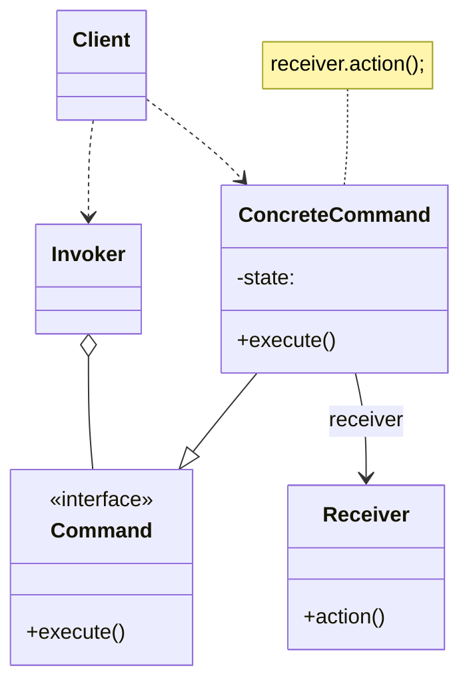

## 命令模式
命令模式(Command Pattern)：将一个请求封装为一个对象，从而让我们可用不同的请求对客户进行参数化；对请求排队或者记录请求日志，以及支持可撤销的操作。命令模式是一种对象行为型模式，其别名为动作(Action)模式或事务(Transaction)模式。

* Command（抽象命令类）：抽象命令类一般是一个抽象类或接口，在其中声明了用于执行请求的execute()等方法，通过这些方法可以调用请求接收者的相关操作。
* ConcreteCommand（具体命令类）：具体命令类是抽象命令类的子类，实现了在抽象命令类中声明的方法，它对应具体的接收者对象，将接收者对象的动作绑定其中。在实现execute()方法时，将调用接收者对象的相关操作(Action)。
* Invoker（调用者）：调用者即请求发送者，它通过命令对象来执行请求。一个调用者并不需要在设计时确定其接收者，因此它只与抽象命令类之间存在关联关系。在程序运行时可以将一个具体命令对象注入其中，再调用具体命令对象的execute()方法，从而实现间接调用请求接收者的相关操作。
* Receiver（接收者）：接收者执行与请求相关的操作，它具体实现对请求的业务处理。

命令模式可以将请求发送者和接收者完全解耦，发送者与接收者之间没有直接引用关系，发送请求的对象只需要知道如何发送请求，而不必知道如何完成请求。

## 类用例图

