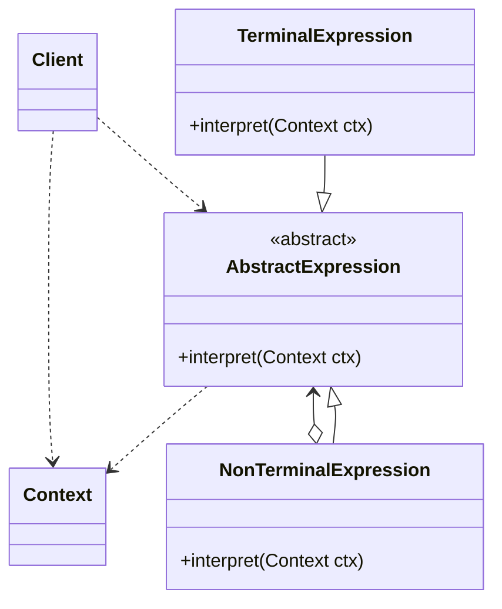

## 解释器模式
解释器模式(Interpreter Pattern)：定义一个语言的文法，并且建立一个解释器来解释该语言中的句子，这里的“语言”是指使用规定格式和语法的代码。解释器模式是一种类行为型模式。

在解释器模式结构图中包含如下几个角色：

* AbstractExpression（抽象表达式）：在抽象表达式中声明了抽象的解释操作，它是所有终结符表达式和非终结符表达式的公共父类。
* TerminalExpression（终结符表达式）：终结符表达式是抽象表达式的子类，它实现了与文法中的终结符相关联的解释操作，在句子中的每一个终结符都是该类的一个实例。通常在一个解释器模式中只有少数几个终结符表达式类，它们的实例可以通过非终结符表达式组成较为复杂的句子。
* NonTerminalExpression（非终结符表达式）：非终结符表达式也是抽象表达式的子类，它实现了文法中非终结符的解释操作，由于在非终结符表达式中可以包含终结符表达式，也可以继续包含非终结符表达式，因此其解释操作一般通过递归的方式来完成。
* Context（环境类）：环境类又称为上下文类，它用于存储解释器之外的一些全局信息，通常它临时存储了需要解释的语句。

## 类用例图

