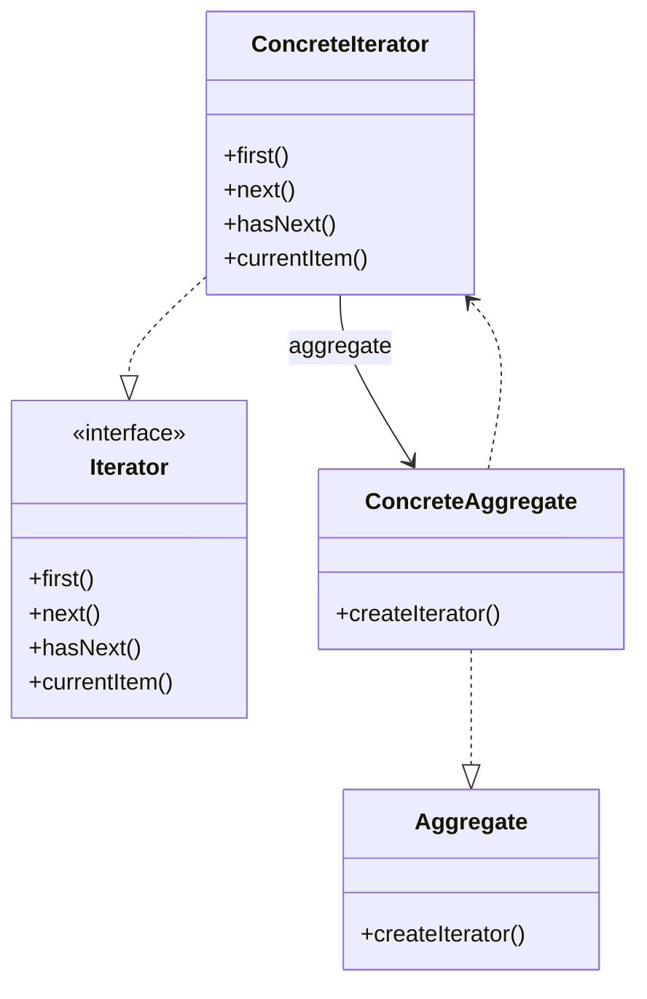

## 迭代器模式
迭代器模式(Iterator Pattern)：提供一种方法来访问聚合对象，而不用暴露这个对象的内部表示，其别名为游标(Cursor)。迭代器模式是一种对象行为型模式

* Iterator（抽象迭代器）：它定义了访问和遍历元素的接口，声明了用于遍历数据元素的方法，例如：用于获取第一个元素的first()方法，用于访问下一个元素的next()方法，用于判断是否还有下一个元素的hasNext()方法，用于获取当前元素的currentItem()方法等，在具体迭代器中将实现这些方法。
* ConcreteIterator（具体迭代器）：它实现了抽象迭代器接口，完成对聚合对象的遍历，同时在具体迭代器中通过游标来记录在聚合对象中所处的当前位置，在具体实现时，游标通常是一个表示位置的非负整数。
* Aggregate（抽象聚合类）：它用于存储和管理元素对象，声明一个createIterator()方法用于创建一个迭代器对象，充当抽象迭代器工厂角色。
* ConcreteAggregate（具体聚合类）：它实现了在抽象聚合类中声明的createIterator()方法，该方法返回一个与该具体聚合类对应的具体迭代器ConcreteIterator实例。

## 类用例图

