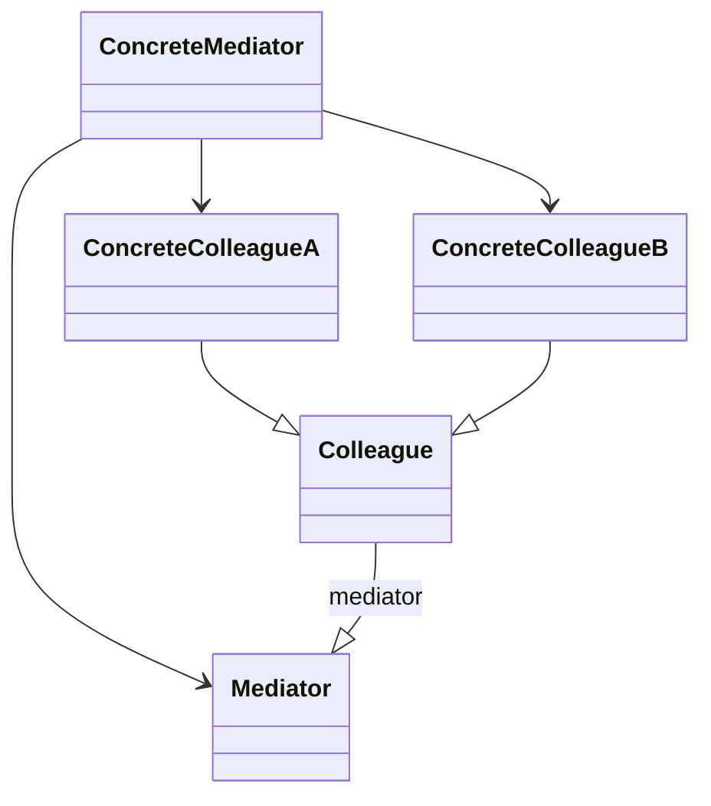

## 中介者模式
中介者模式(Mediator Pattern)：用一个中介对象（中介者）来封装一系列的对象交互，中介者使各对象不需要显式地相互引用，从而使其耦合松散，而且可以独立地改变它们之间的交互。中介者模式又称为调停者模式，它是一种对象行为型模式。

* Mediator（抽象中介者）：它定义一个接口，该接口用于与各同事对象之间进行通信。
* ConcreteMediator（具体中介者）：它是抽象中介者的子类，通过协调各个同事对象来实现协作行为，它维持了对各个同事对象的引用。
* Colleague（抽象同事类）：它定义各个同事类公有的方法，并声明了一些抽象方法来供子类实现，同时它维持了一个对抽象中介者类的引用，其子类可以通过该引用来与中介者通信。
* ConcreteColleague（具体同事类）：它是抽象同事类的子类；每一个同事对象在需要和其他同事对象通信时，先与中介者通信，通过中介者来间接完成与其他同事类的通信；在具体同事类中实现了在抽象同事类中声明的抽象方法。

## 类用例图

