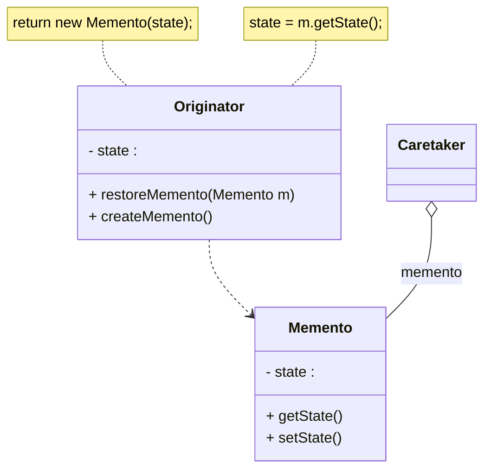

## 备忘录模式
备忘录模式(Memento Pattern)：在不破坏封装的前提下，捕获一个对象的内部状态，并在该对象之外保存这个状态，这样可以在以后将对象恢复到原先保存的状态。它是一种对象行为型模式，其别名为Token。

* Originator（原发器）：它是一个普通类，可以创建一个备忘录，并存储它的当前内部状态，也可以使用备忘录来恢复其内部状态，一般将需要保存内部状态的类设计为原发器。
* Memento（备忘录)：存储原发器的内部状态，根据原发器来决定保存哪些内部状态。备忘录的设计一般可以参考原发器的设计，根据实际需要确定备忘录类中的属性。需要注意的是，除了原发器本身与负责人类之外，备忘录对象不能直接供其他类使用，原发器的设计在不同的编程语言中实现机制会有所不同。
* Caretaker（负责人）：负责人又称为管理者，它负责保存备忘录，但是不能对备忘录的内容进行操作或检查。在负责人类中可以存储一个或多个备忘录对象，它只负责存储对象，而不能修改对象，也无须知道对象的实现细节。

## 类用例图

