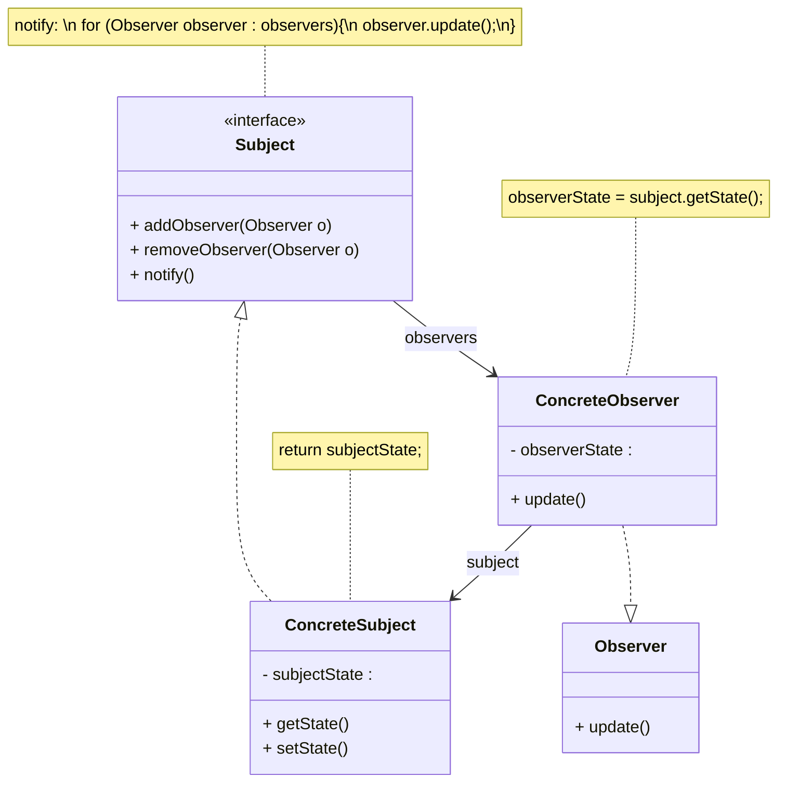

## 观察者模式
观察者模式(Observer Pattern)：定义对象之间的一种一对多依赖关系，使得每当一个对象状态发生改变时，其相关依赖对象皆得到通知并被自动更新。观察者模式的别名包括发布-订阅（Publish/Subscribe）模式、模型-视图（Model/View）模式、源-监听器（Source/Listener）模式或从属者（Dependents）模式。观察者模式是一种对象行为型模式。

* Subject（目标）：目标又称为主题，它是指被观察的对象。在目标中定义了一个观察者集合，一个观察目标可以接受任意数量的观察者来观察，它提供一系列方法来增加和删除观察者对象，同时它定义了通知方法notify()。目标类可以是接口，也可以是抽象类或具体类。
* ConcreteSubject（具体目标）：具体目标是目标类的子类，通常它包含有经常发生改变的数据，当它的状态发生改变时，向它的各个观察者发出通知；同时它还实现了在目标类中定义的抽象业务逻辑方法（如果有的话）。如果无须扩展目标类，则具体目标类可以省略。
* Observer（观察者）：观察者将对观察目标的改变做出反应，观察者一般定义为接口，该接口声明了更新数据的方法update()，因此又称为抽象观察者。
* ConcreteObserver（具体观察者）：在具体观察者中维护一个指向具体目标对象的引用，它存储具体观察者的有关状态，这些状态需要和具体目标的状态保持一致；它实现了在抽象观察者Observer中定义的update()方法。通常在实现时，可以调用具体目标类的attach()方法将自己添加到目标类的集合中或通过detach()方法将自己从目标类的集合中删除

## 类用例图

