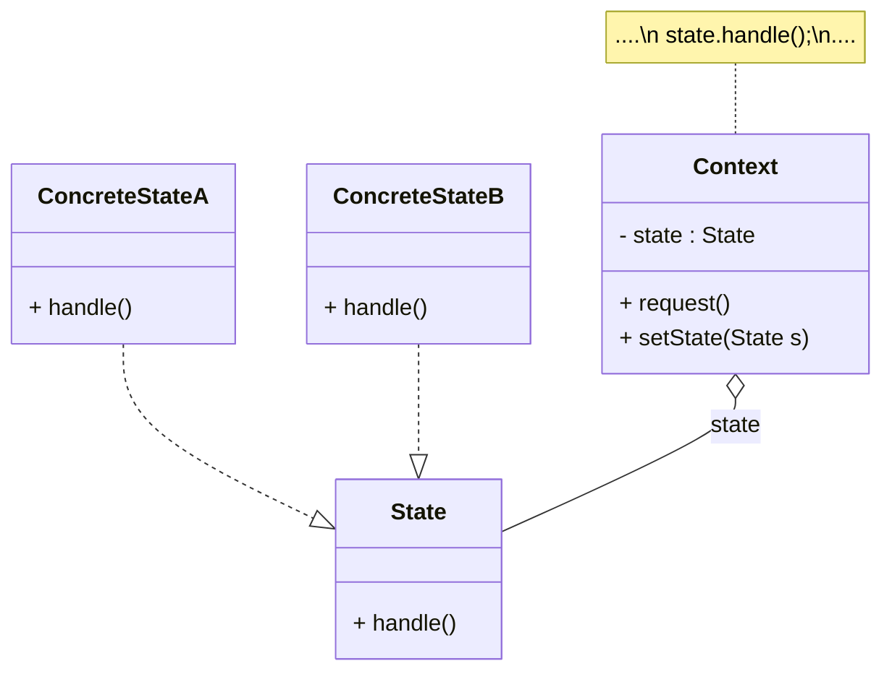

## 状态模式
状态模式(State Pattern)：允许一个对象在其内部状态改变时改变它的行为，对象看起来似乎修改了它的类。其别名为状态对象(Objects for States)，状态模式是一种对象行为型模式。

* Context（环境类）：环境类又称为上下文类，它是拥有多种状态的对象。由于环境类的状态存在多样性且在不同状态下对象的行为有所不同，因此将状态独立出去形成单独的状态类。在环境类中维护一个抽象状态类State的实例，这个实例定义当前状态，在具体实现时，它是一个State子类的对象。
* State（抽象状态类）：它用于定义一个接口以封装与环境类的一个特定状态相关的行为，在抽象状态类中声明了各种不同状态对应的方法，而在其子类中实现类这些方法，由于不同状态下对象的行为可能不同，因此在不同子类中方法的实现可能存在不同，相同的方法可以写在抽象状态类中。
* ConcreteState（具体状态类）：它是抽象状态类的子类，每一个子类实现一个与环境类的一个状态相关的行为，每一个具体状态类对应环境的一个具体状态，不同的具体状态类其行为有所不同。
## 类用例图

