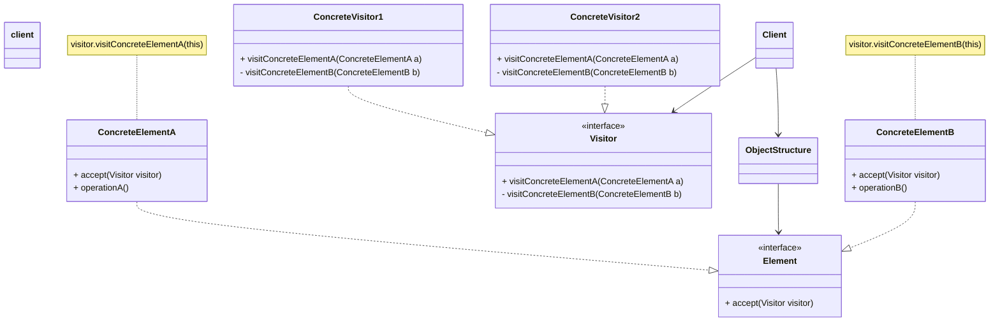

## 访问者模式
访问者模式(Visitor Pattern):提供一个作用于某对象结构中的各元素的操作表示，它使我们可以在不改变各元素的类的前提下定义作用于这些元素的新操作。访问者模式是一种对象行为型模式。

* Visitor（抽象访问者）：抽象访问者为对象结构中每一个具体元素类ConcreteElement声明一个访问操作，从这个操作的名称或参数类型可以清楚知道需要访问的具体元素的类型，具体访问者需要实现这些操作方法，定义对这些元素的访问操作。
* ConcreteVisitor（具体访问者）：具体访问者实现了每个由抽象访问者声明的操作，每一个操作用于访问对象结构中一种类型的元素。
* Element（抽象元素）：抽象元素一般是抽象类或者接口，它定义一个accept()方法，该方法通常以一个抽象访问者作为参数。
* ConcreteElement（具体元素）：具体元素实现了accept()方法，在accept()方法中调用访问者的访问方法以便完成对一个元素的操作。
* ObjectStructure（对象结构）：对象结构是一个元素的集合，它用于存放元素对象，并且提供了遍历其内部元素的方法。它可以结合组合模式来实现，也可以是一个简单的集合对象，如一个List对象或一个Set对象。

## 类用例图

