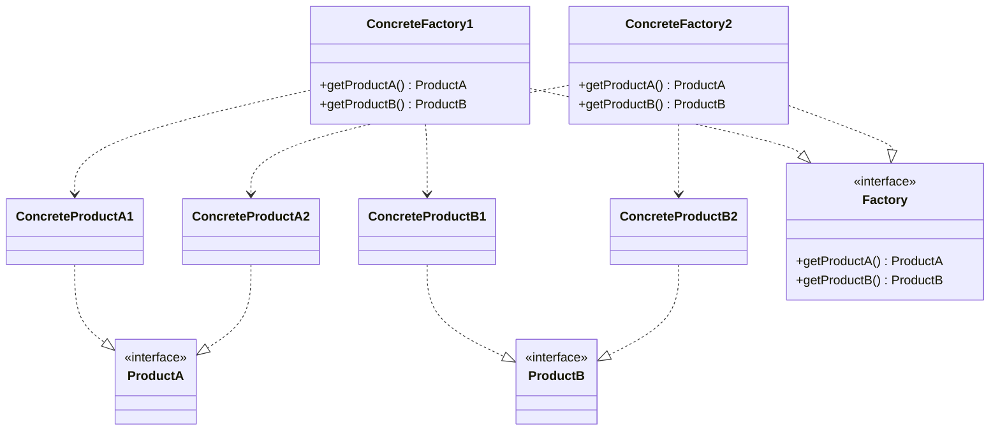

## 简单工厂
工厂方法模式(Factory Method Pattern)：定义一个用于创建对象的接口，让子类决定将哪一个类实例化。工厂方法模式让一个类的实例化延迟到其子类。工厂方法模式又简称为工厂模式(Factory Pattern)，又可称作虚拟构造器模式(Virtual Constructor Pattern)或多态工厂模式(Polymorphic Factory Pattern)。

* Factory（抽象工厂）：它声明了一组用于创建一族产品的方法，每一个方法对应一种产品。
* ConcreteFactory（具体工厂）：它实现了在抽象工厂中声明的创建产品的方法，生成一组具体产品，这些产品构成了一个产品族，每一个产品都位于某个产品等级结构中。
* Product（抽象产品）：它为每种产品声明接口，在抽象产品中声明了产品所具有的业务方法。
* ConcreteProduct（具体产品）：它定义具体工厂生产的具体产品对象，实现抽象产品接口中声明的业务方法。

## 类用例图
