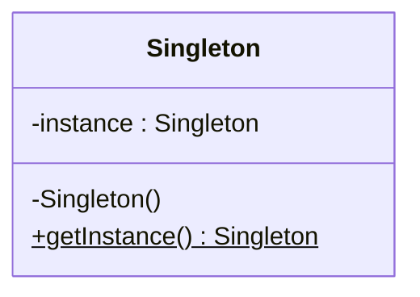

## 单例模式
单例模式(Singleton Pattern)：确保某一个类只有一个实例，而且自行实例化并向整个系统提供这个实例，这个类称为单例类，它提供全局访问的方法。

## 类用例图

```mermaid
%% classDiagram 定义类图
%% - 私有
%% + 公有
%% # 受保护
%% ~ 包/内部
%% $ 静态方法、静态变量
%% * 抽象方法

%% <<interface>> 接口
%% <<abstract>> 抽象类
%% <<service>> 服务等级
%% <<enumeration>> 枚举

%% ..> 依赖：只要在类中引用了另一个类的类，那么它们之间就是依赖关系。比如类A中有方法m，方法m的返回值类型为类B，此时，类A与类B依赖。
%% --> 关联：相较于依赖关系，关联关系的依赖性更高。比如类A中有成员属性b，此时类A与类B关联。
%% --o 聚合：关联性是更强的关联关系。是整体和个体的关系。但二者可分割。比如类A中有成员属性b，并且属性b通过setter赋值，此时二者就是聚合关系。
%% --* 组合: 关联性是更强的关联关系。是整体和部分的关系。二者不可分割。比如类A中有成员属性b，并且属性b是在类A的构造方法中赋值，此时二者就是组合关系。
%% ..|> 实现: 类A实现了类B（接口或抽象类）
%% -–|> 继承: 类A继承了类B

classDiagram
class Singleton{
    -instance : Singleton
    -Singleton()
    +getInstance() Singleton$
}
```