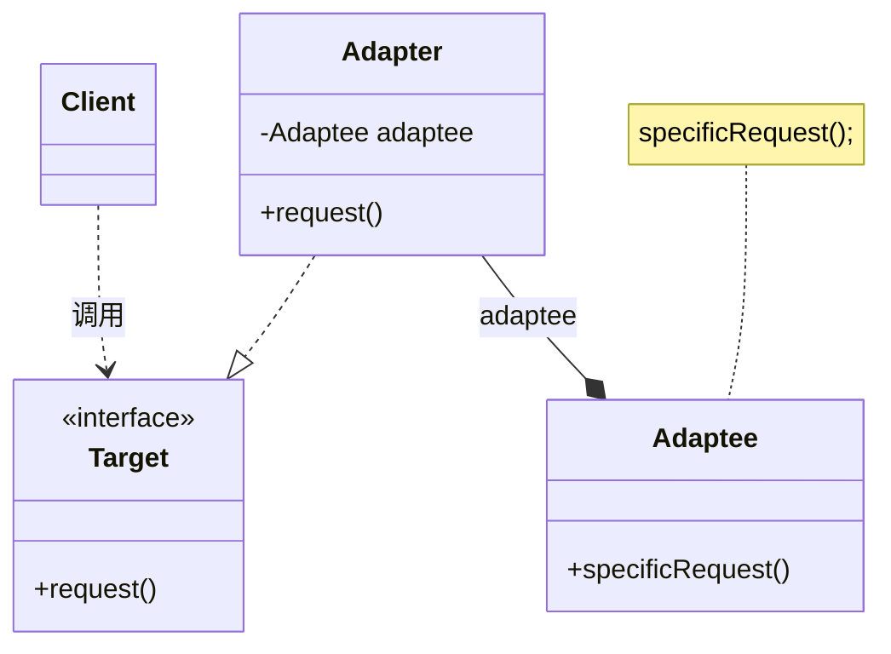
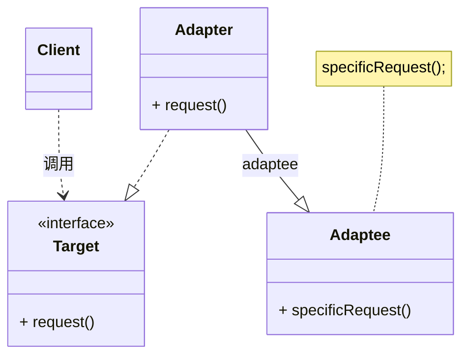

## 适配器模式
适配器模式(Adapter Pattern)：将一个接口转换成客户希望的另一个接口，使接口不兼容的那些类可以一起工作，其别名为包装器(Wrapper)。适配器模式既可以作为类结构型模式，也可以作为对象结构型模式。

对象适配器模式: 适配器与适配者之间是关联关系
类适配器模式: 适配器与适配者之间是继承（或实现）关系

* Target（目标抽象类）：目标抽象类定义客户所需接口，可以是一个抽象类或接口，也可以是具体类。
* Adapter（适配器类）：适配器可以调用另一个接口，作为一个转换器，对Adaptee和Target进行适配，适配器类是适配器模式的核心，在对象适配器中，它通过继承Target并关联一个Adaptee对象使二者产生联系。
* Adaptee（适配者类）：适配者即被适配的角色，它定义了一个已经存在的接口，这个接口需要适配，适配者类一般是一个具体类，包含了客户希望使用的业务方法，在某些情况下可能没有适配者类的源代码。

## 类用例图

### 对象适配器

### 类适配器模式
