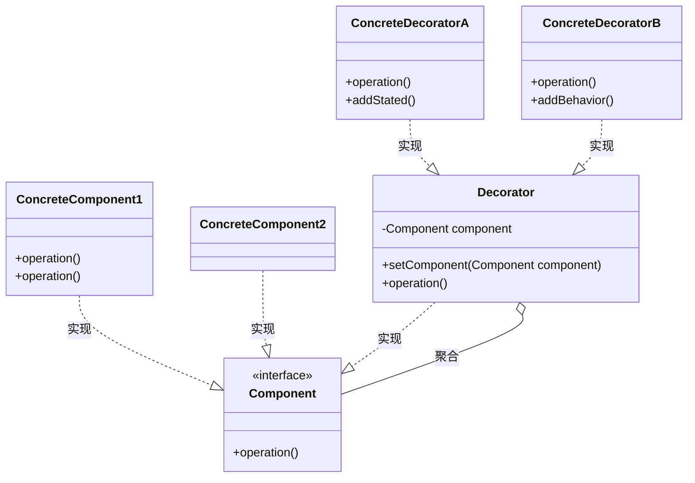

## 装饰模式
装饰模式(Decorator Pattern)：动态地给一个对象增加一些额外的职责，就增加对象功能来说，装饰模式比生成子类实现更为灵活。装饰模式是一种对象结构型模式。

* Component（抽象组件）：它是具体构件和抽象装饰类的共同父类，声明了在具体构件中实现的业务方法，它的引入可以使客户端以一致的方式处理未被装饰的对象以及装饰之后的对象，实现客户端的透明操作。
* ConcreteComponent（具体组件）：它是抽象构件类的子类，用于定义具体的构件对象，实现了在抽象构件中声明的方法，装饰器可以给它增加额外的职责（方法）。
* Decorator（抽象装饰类）：它也是抽象构件类的子类，用于给具体构件增加职责，但是具体职责在其子类中实现。它维护一个指向抽象构件对象的引用，通过该引用可以调用装饰之前构件对象的方法，并通过其子类扩展该方法，以达到装饰的目的。
* ConcreteDecorator（具体装饰类）：它是抽象装饰类的子类，负责向构件添加新的职责。每一个具体装饰类都定义了一些新的行为，它可以调用在抽象装饰类中定义的方法，并可以增加新的方法用以扩充对象的行为。

代理是全权代理，目标根本不对外，全部由代理类来完成。
装饰是增强，是辅助，目标仍然可以自行对外提供服务，装饰器只起增强作用。
## 类用例图

